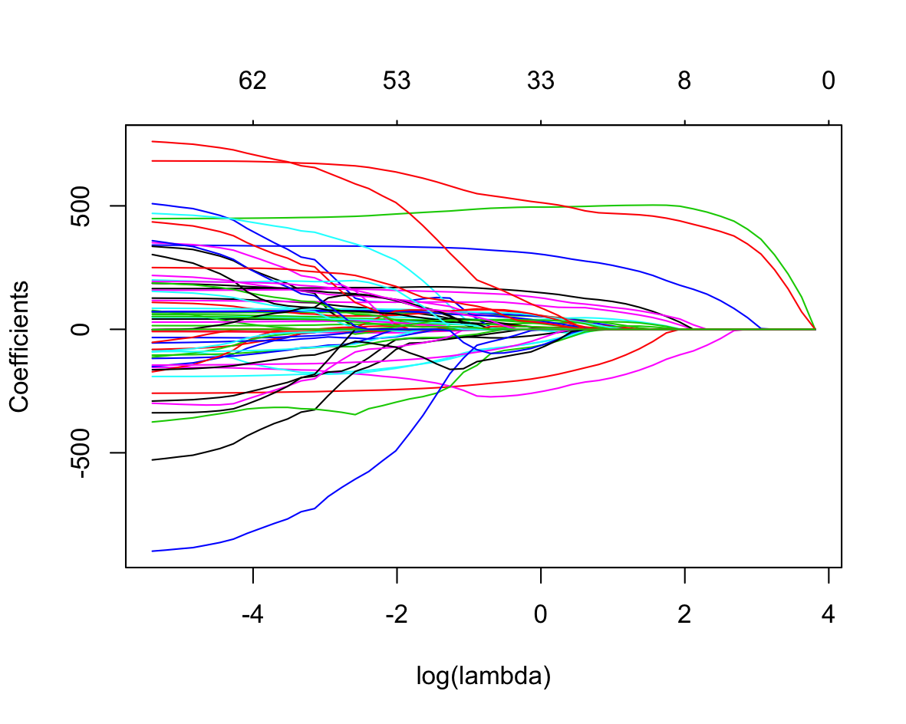
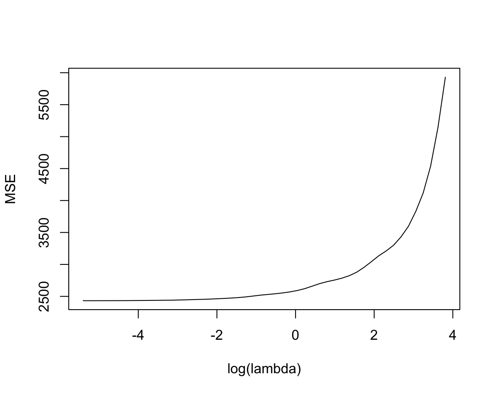
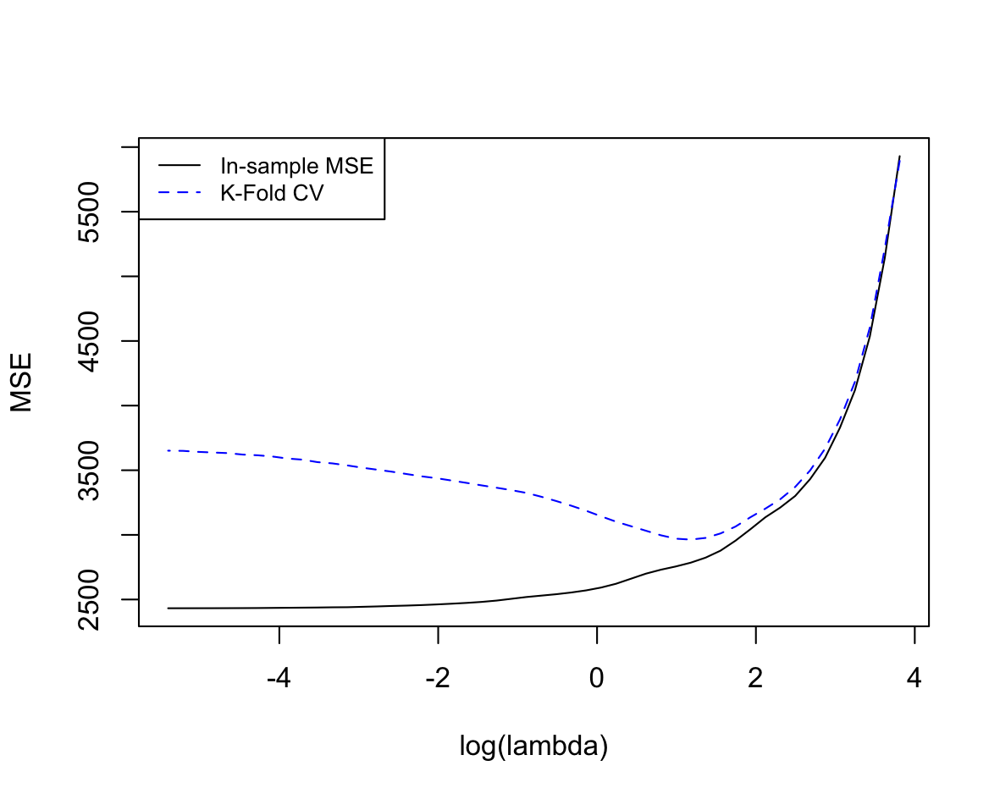
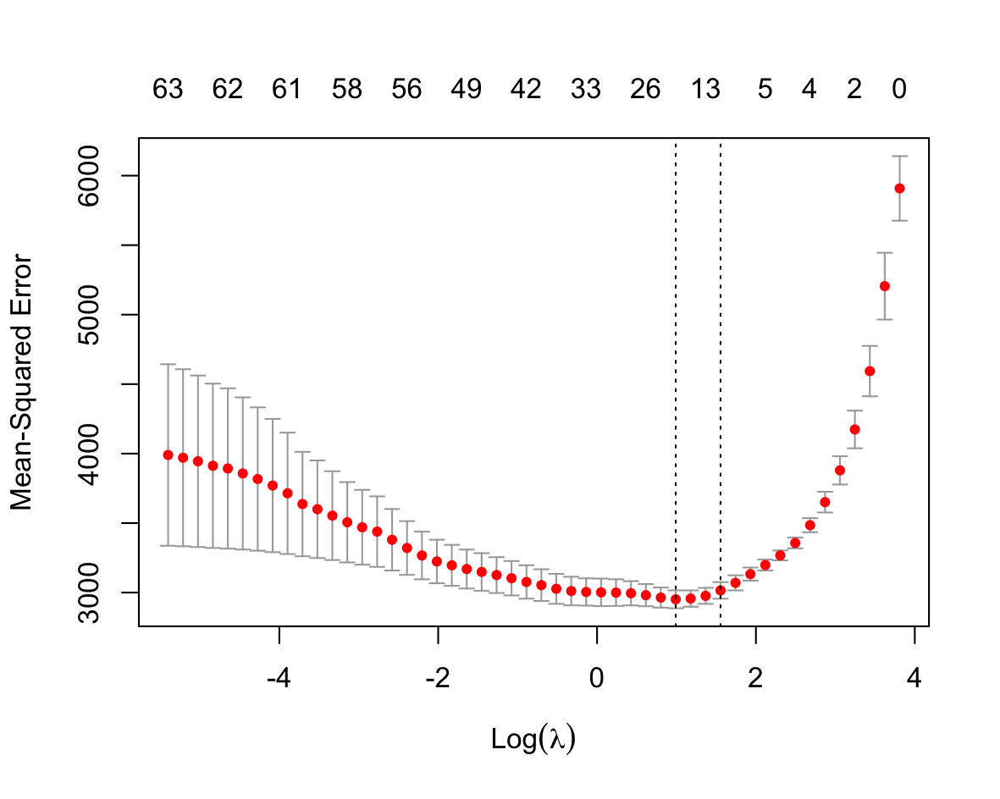
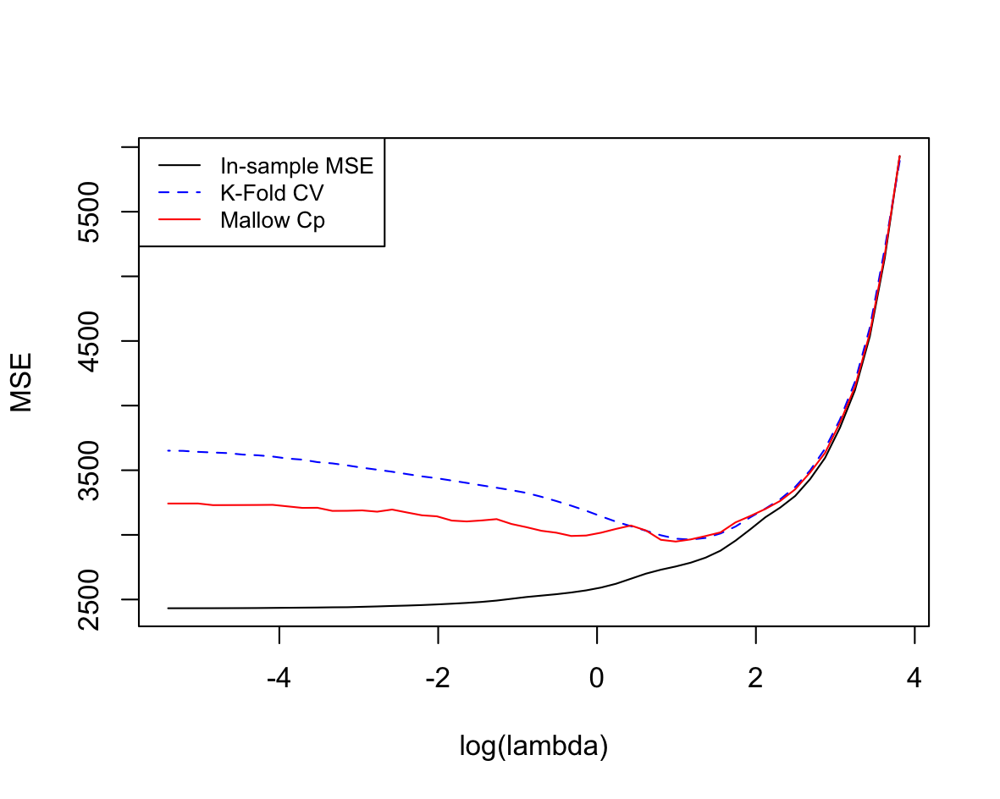

[This post is still under development :/]

This is the first post I prepare for a Data Science Topic. I want to take this opportunity to review key concepts in Statistics by writing examples that can be usefull for others. Feel free to [contact](https://nzunigag.github.io/contact/) me with questions or suggestions. 


# Lasso Regression


## Model
Consider the standard linear regression model

$$
y = X \beta + e \, ,
$$

where $y$ is an $n$-vector of responses, $X$ is an $n \times p$ features matrix whose $i$th row $x_i$ is the vector of features for observation $i$, and $e$ is a vector of errors/residuals.

The lasso involves estimating $\beta$ as the solution to the penalized least-squares problem

$$
\hat{\beta} = \arg \min_{\beta} \; \frac{1}{2} \Vert y - X \beta \Vert_2^2 + \lambda \Vert \beta \Vert_1 \, ,
$$

where $\Vert \beta \Vert_1$ is the $\ell_1$ (pronounced ``ell one'') norm of the coefficient vector:

$$
\Vert \beta \Vert_1 = \sum_{j=1}^p |\beta_j| \, .
$$

The penalty function is just like the absolute-value penalty you used on the normal-means problem, generalized to the vector case.  And just as in in the normal means problem, this penalty function will have the effect of both selecting a set of nonzero $\beta_i$'s (i.e.~sparsifying the estimate) as well as shrinking the nonzero $\beta_i$'s toward 0.  The bigger $\lambda$, the more aggressive the shrinkage effect.

Note: we typically leave the intercept in a lasso fit unpenalized.  We can accomplish this by explicitly introducing an intercept, e.g. writing the objective as

$$
\frac{1}{2n} \Vert y - (\alpha \mathbf{1} + X \beta) \Vert_2^2 + \lambda \Vert \beta \Vert_1 \, ,
$$

where $\alpha$ is a scalar intercept and $\mathbf{1}$ is a vector of all 1's.  Or we can leave the problem in its original form above, and assume that both the response variable $y$ and all columns of the predictor matrix have been standardized have a mean of 0 (in which case there is no need for an explicit intercept).  For the rest of these exercises, we'll assume that the variables have been standardized in this way.

To read more about lasso regression, consult Chapter 3.4.2 of The Elements of Statistical Learning, or the [original paper](http://statweb.stanford.edu/~tibs/lasso/lasso.pdf) by Robert Tibshirani.

## Example using R

The material in this post can be accessed in this [GitHub repository](https://github.com/nzunigag/blog_post_lasso_regression).

Using the Diabetes example dataset, we build a regression models with R.


```{r}
library(glmnet)
set.seed(1234)

# Load Diabetes Data
X = read.csv('diabetesX.csv')
X = as.matrix(X) 
Y = read.csv('diabetesY.csv',header=F)
Y = Y[,1]

N <- 50 # Number of lambdas
fit <- glmnet(X, Y, alpha = 1, nlambda = N)
plot(fit, xvar = 'lambda', xlab = 'log(lambda)')
```




```{r}
# In-sample mean square prediction error (MSE)
Y.prediction <- predict.glmnet(fit, newx = X)
MSE <- array(NA, dim = N)
for (i in 1:N){
  MSE[i] <- mean((Y.prediction[,i] - Y)^2)
}

plot(log(fit$lambda), MSE, type = "l", xlab = 'log(lambda)')
```



```{r}
K_fold <- function(X, Y, K, lambda){
  # Compute the K-fold Cross-Validation
  # Input:
  # X = features (matrix M x P)
  # y = vector of observations (vector M)
  # K = number of folds (constant, typically 5 or 10)
  # lambda = set of complexity parameters (vector N)
  # Output:
  # MSE = Mean Square Error (vector N)
  
  # We split the data into K roughly equal-sized parts 
  # using an indexing function
  partition <- cut(1:dim(X)[1], breaks = K, labels=FALSE)
  # Randomization
  partition <- sample(partition)
  
  N <- length(lambda)
  MSE <- array(NA, dim = c(K, N))
  for (i in 1:K){
    validation <- partition == i  # Validation Kth part
    X.validation <- X[validation,]
    Y.validation <- Y[validation]
    train <- !validation  # Train part
    X.train <- X[train,]
    Y.train <- Y[train]
    fit <- glmnet(X.train, Y.train, alpha = 1, lambda = lambda)
    Y.prediction <- predict.glmnet(fit, newx = X.validation)
    for (j in 1:N){
      MSE[i, j] <- mean(((Y.prediction[,j] - Y.validation)^2))
    }
  }
  colMeans(MSE)
}
```


```{r}
# Applying the cross validation using K-fold function
K <- 5 
MSE_Kfold <- K_fold(X, Y, K, fit$lambda)

plot(log(fit$lambda), MSE, type = "l", xlab = 'log(lambda)')
points(log(fit$lambda), MSE_Kfold, type="l", col="blue",lty=2)
legend('topleft',legend = c('In-sample MSE','K-Fold CV'), 
       col=c("black", "blue"), lty=1:2, cex=0.8)
```



```{r}
# Sanity Check for K-fold CV
MSE_check <- cv.glmnet(X, Y, lambda = fit$lambda, nfolds = K)
plot(MSE_check)

```



```{r}
# Collin Mallows's Cp Statistic
Cp_Mallows <- function(X, Y, lambda){
  # Compute the Collin Mallows's Cp Statistic
  # Input:
  # X = features (matrix M x P)
  # y = vector of observations (vector M)
  # lambda = set of complexity parameters (vector N)
  # Output:
  # Cp = Collin Mallows's Cp Statistic (vector N)
  
  N <- length(lambda)
  M <- dim(X)[1]
  P <- dim(X)[2]
  # Obtain the unbiased sigma-square from the OLS
  fit <- glmnet(X, Y, alpha = 1, lambda = 0)
  Y.OLS <- predict.glmnet(fit, newx = X)
  sigma.square <- sum((Y - Y.OLS) ^ 2) / (M - P)
  # In-sample mean square prediction error
  fit <- glmnet(X, Y, alpha = 1, lambda = lambda)
  Y.prediction <- predict.glmnet(fit, newx = X)
  MSE <- array(NA, dim = N)
  for (i in 1:N){
    MSE[i] <- mean((Y.prediction[,i] - Y)^2)
  }
  # Estimate the Cp Statistics
  MSE + 2 * (fit$df / M) * sigma.square
}
```

```{r}
# Applying the Collin Mallows's Cp Statistic function
MSE_Cp <- Cp_Mallows(X, Y, fit$lambda)

plot(log(fit$lambda), MSE, type = "l", xlab = 'log(lambda)')
points(log(fit$lambda), MSE_Kfold, type="l", col="blue",lty=2)
points(log(fit$lambda), MSE_Cp, type="l", col="red")
legend('topleft',legend = c('In-sample MSE','K-Fold CV','Mallow Cp'), 
       col=c("black", "blue","red"), lty=1:2, cex=0.8)
```



## Conclusion


### Fun fact
If you speak Spanish, this regression may have a funny name for you. The word "lasso" sounds like "lazo," which in English means "ribbon." 
What's funny is how the profiles of the lasso coefficients look like ribbons themselves :O #StatsIsFun.


### Acknowledgment 

This post is made using material from the Big Data course I took during my master's in Statistics at UT Austin. Feel free to check the content of the course in this [GitHub page](https://github.com/jgscott/SDS385) or visit my [personal GitHub](https://github.com/nzunigag/SDS-385-Statistical-Models-for-Big-Data) that includes my solutions to the course exercises.

